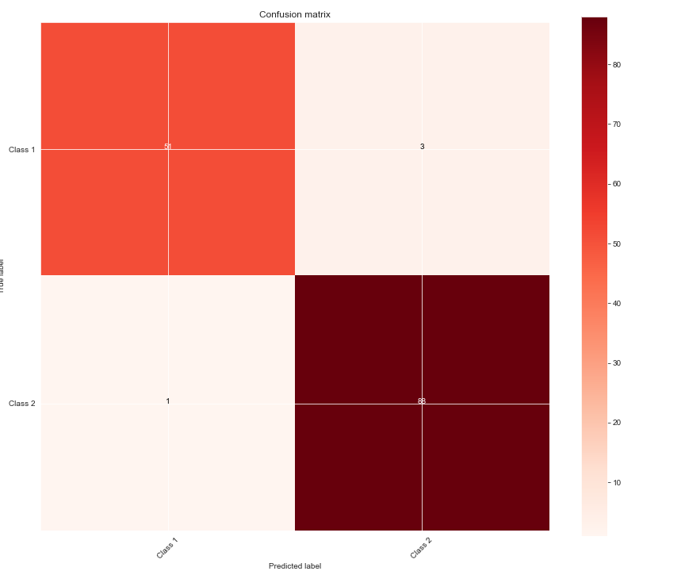
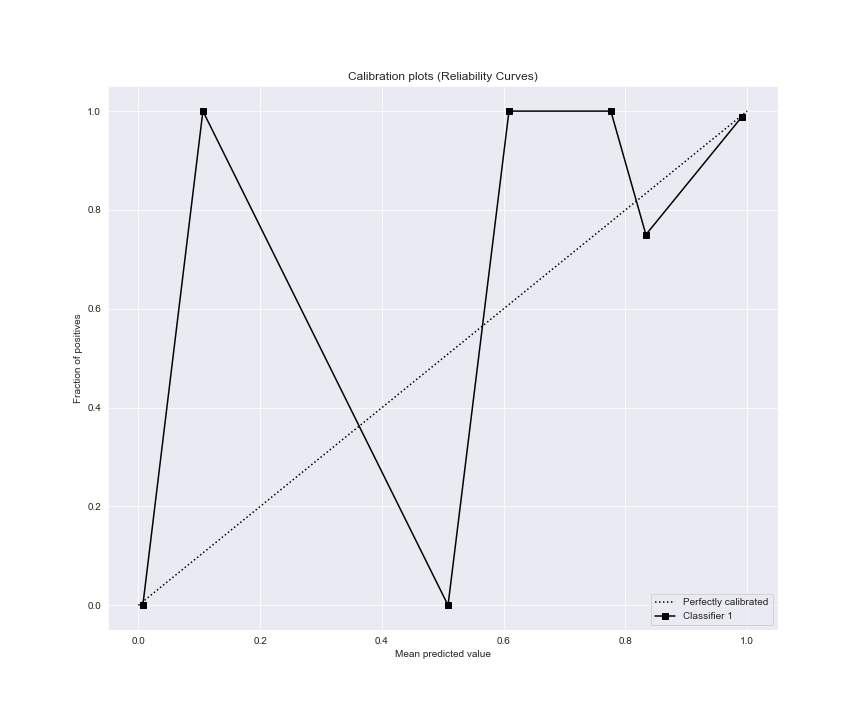
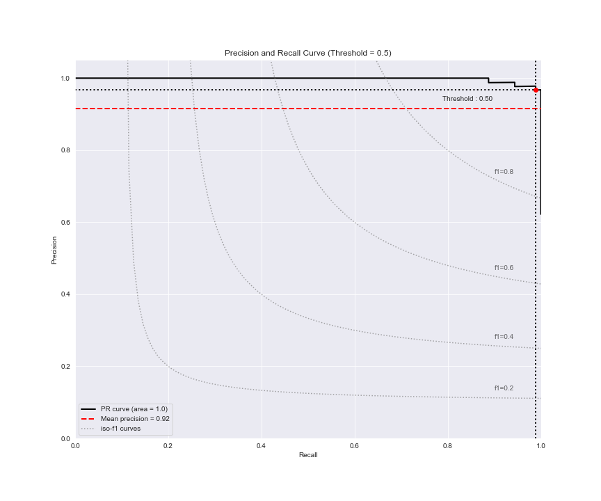
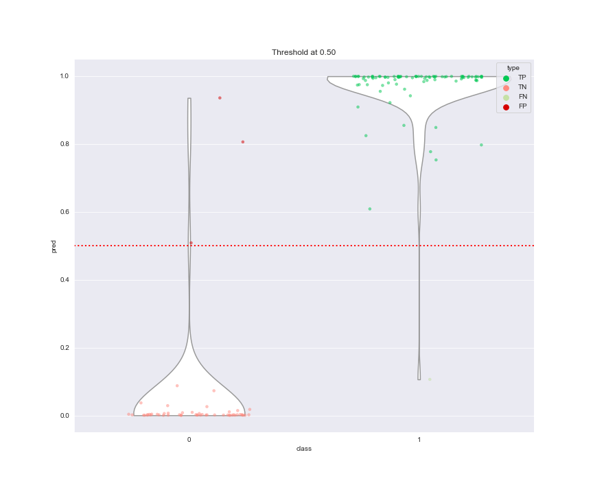
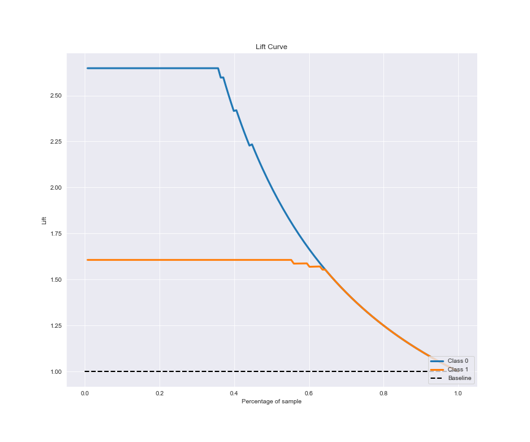
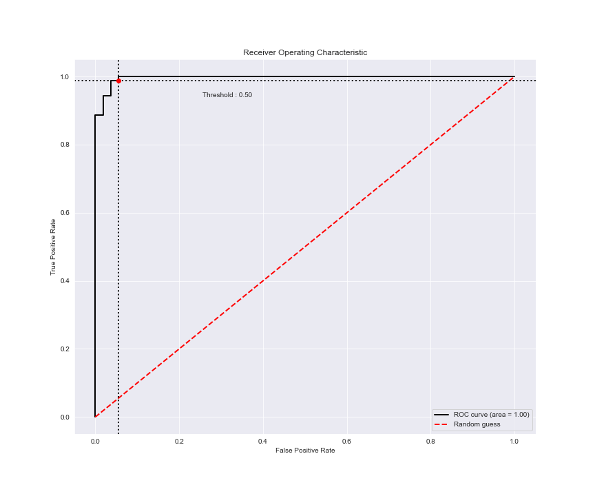
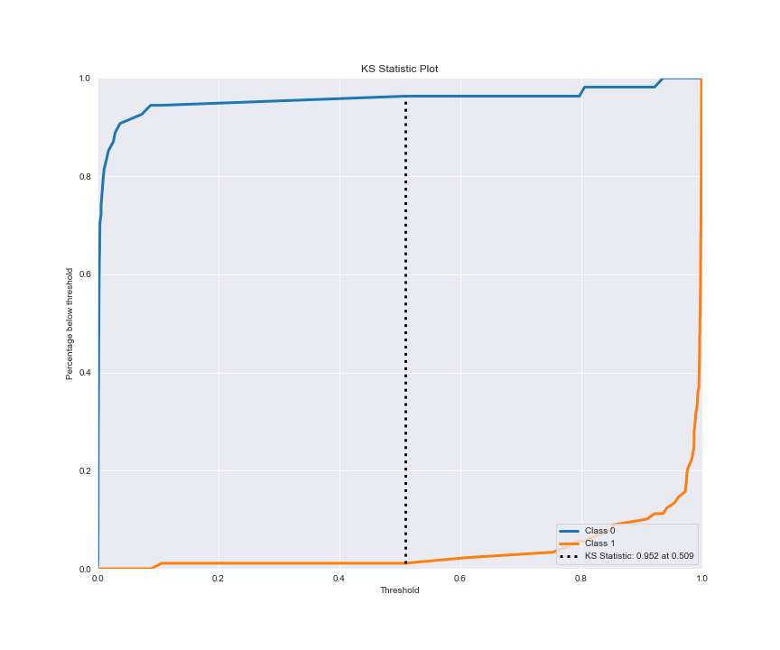
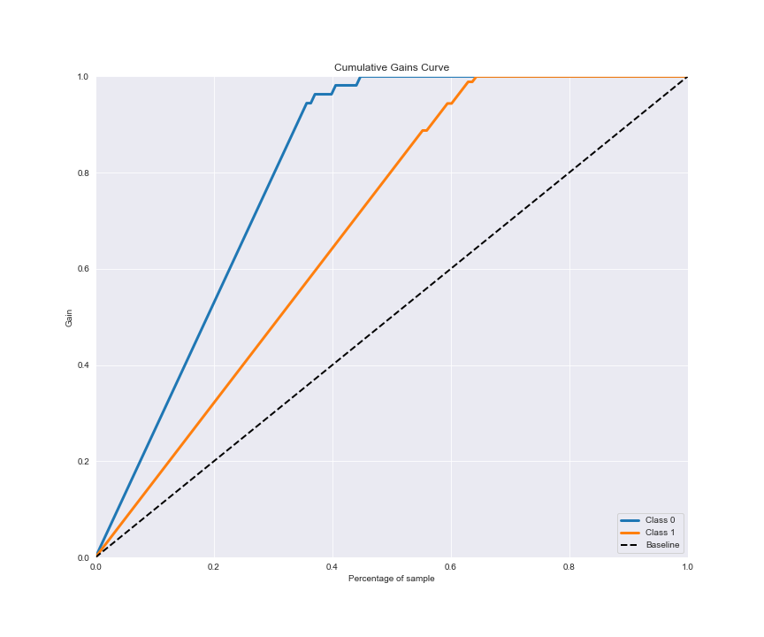

# Metrics Report

#### Type: classification

## Data info

| Info | Value |
| --- | --- |
| Count of samples | 143 |
| Count True class | 89 |
| Count False class | 54 |
| Class balance % | 62.2 |

## Metrics

**threshold: 0.5**

| Metric | Value |
| --- | --- |
| AUC | 0.9967 |
| Log Loss | 0.0718 |
| Average\_Precision | 0.9979 |
| Accuracy | 0.972 |
| Precision | 0.9722 |
| Recall | 0.972 |
| F1 Score | 0.9719 |
| MCC | 0.9405 |
| TN | 51 |
| FP | 3 |
| FN | 1 |
| TP | 88 |

## Plots

